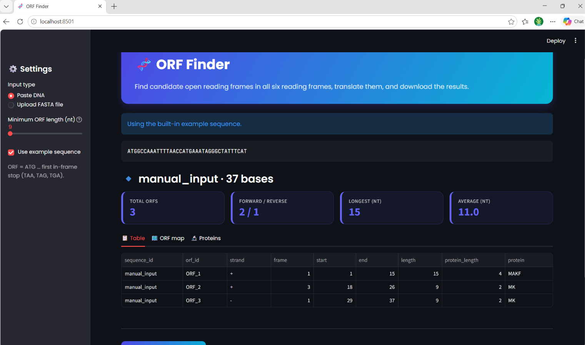
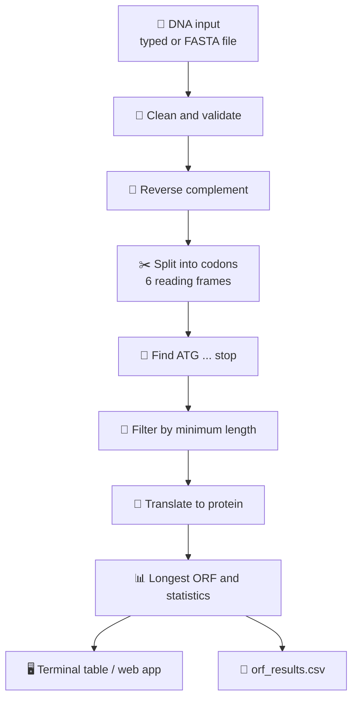

<div align="center">

# 🧬 ORF Analysis Pipeline

### Find, translate and explore candidate Open Reading Frames with Python & Biopython


[Features](#-features) · [Quick start](#-quick-start) · [Example](#-example-output) · [How it works](#-how-it-works) · [Limitations](#-limitations) · [Roadmap](#-roadmap)

</div>

---

## 📖 About

This project takes a **DNA sequence or FASTA file** and finds **candidate open reading frames (ORFs)** across all **six reading frames**. Each ORF is translated into a protein, summarised with basic statistics, and exported to CSV. It can be used from the **command line** or through a **Streamlit web app**.

It was built as a learning project during my M.Sc. Bioinformatics studies, with the goal of understanding every step of ORF detection instead of only using an existing tool.

> ⚠️ **Note:** the tool reports *candidate* ORFs, not confirmed genes. See [Limitations](#-limitations).

<!-- Add your screenshot below after running the app -->
<div align="center">



</div>

---

## ✨ Features

| | Feature |
|---|---|
| 📥 | Input by **pasting DNA** or uploading a **single or multi-record FASTA** file (Biopython `SeqIO`) |
| 🧹 | **Cleaning and validation** of DNA with clear, record-specific error messages |
| 🔁 | **Six-frame analysis**: +1, +2, +3 and −1, −2, −3 using `reverse_complement()` |
| 🎯 | **ATG start** and **TAA / TAG / TGA stop** detection |
| 📍 | **Reverse-strand coordinates mapped back** to the original sequence |
| 🧪 | **Protein translation** with `Seq.translate()` |
| 🎚️ | Adjustable **minimum ORF length** |
| 📊 | **Longest ORF** and statistics: counts per strand, min, max and average length |
| 💾 | **CSV export** (`results/orf_results.csv`) |
| 🌐 | **Streamlit app** with an ORF map, protein viewer and download button |
| ✅ | **Unit tests** with pytest |

---

## 🚀 Quick start

### 1. Clone and install (Windows)

```bash
git clone https://github.com/<your-username>/ORF-analysis-pipeline.git
cd ORF-analysis-pipeline
python -m venv venv
venv\Scripts\activate
pip install -r requirements.txt
```

<details>
<summary>macOS / Linux</summary>

```bash
source venv/bin/activate
```

</details>

### 2. Choose how to run it

**🖥️ Command line**

```bash
python src/main.py
```

Choose `1` to paste DNA or `2` to read a FASTA file. Press Enter at the path prompt to use `data/sample.fasta`.

**🌐 Web app**

```bash
streamlit run src/app.py
```

Then open <http://localhost:8501>. Tick **Use example sequence** in the sidebar for an instant demo.

**✅ Tests**

```bash
pytest
```

---

## 📊 Example output

**Input:** [`data/sample.fasta`](data/sample.fasta)

| sequence_id | orf_id | strand | frame | start | end | length | protein_length | protein |
|---|---|---|---|---|---|---|---|---|
| seq1 | ORF_1 | + | 1 | 1 | 15 | 15 | 4 | MAKF |
| seq1 | ORF_2 | + | 2 | 20 | 34 | 15 | 4 | MKPG |
| seq2 | ORF_1 | + | 1 | 1 | 21 | 21 | 6 | MRTLAS |
| seq2 | ORF_2 | − | 3 | 14 | 25 | 12 | 3 | MLS |

Saved as [`results/orf_results.csv`](results/orf_results.csv).

<details>
<summary>📟 Terminal output</summary>

```text
Sequence: seq2 (27 bases)
ORF      Strand  Frame   Start    End  Length  Protein
------------------------------------------------------
ORF_1    +       1           1     21      21  MRTLAS
ORF_2    -       3          14     25      12  MLS
Longest ORF: ORF_1 (21 nt)
Statistics: 2 ORFs (1 forward, 1 reverse), average length 16.5 nt
```

</details>

---

## 🔬 How it works



### Biopython functions used

| Function | Purpose |
|---|---|
| `Bio.Seq.Seq` | Biological sequence object |
| `Seq.reverse_complement()` | Opposite DNA strand |
| `Seq.translate(to_stop=True)` | DNA → protein, stopping at the first stop codon |
| `Bio.SeqIO.parse()` | Read one or many FASTA records |

### ORF rules used in this project

- An ORF starts with **ATG** and ends at the **first in-frame stop** (TAA, TAG or TGA).
- If several ATGs occur in one frame before a stop, the ORF begins at the **first** one.
- ORFs without a stop codon are **discarded**.
- Coordinates are **1-based** and always on the **forward strand** (start < end). The `strand` column shows the reading direction.
- ORF length **includes** the stop codon. Protein length does **not**.

---

## 📁 Project structure

```text
ORF-analysis-pipeline/
├── data/
│   └── sample.fasta          # example input
├── results/
│   └── orf_results.csv       # example output
├── images/                   # README screenshots
├── src/
│   ├── sequence_utils.py     # cleaning, validation, FASTA reading
│   ├── orf_finder.py         # reverse complement, frames, ORF detection
│   ├── translator.py         # translation, filtering, statistics
│   ├── output_utils.py       # terminal table and CSV writer
│   ├── main.py               # command-line pipeline
│   └── app.py                # Streamlit web app
├── tests/                    # pytest unit tests
├── pytest.ini
├── requirements.txt
└── README.md
```

---

## ⚠️ Limitations

This tool finds **candidate** ORFs. It does **not** handle:

- Introns (eukaryotic genes are usually not one continuous ORF)
- Alternative start codons (GTG, TTG)
- Overlapping or nested genes (only the first ATG is used)
- Incomplete ORFs at sequence ends
- Ambiguous bases (`N`) or RNA (`U`) input
- Non-standard genetic codes
- Any evidence beyond sequence: no homology, expression or regulatory signals

A long ORF is suggestive, but real genes need supporting evidence. Dedicated tools such as NCBI ORFfinder, Prodigal or GeneMark are far more sophisticated.

---

## 🗺️ Roadmap

- [ ] Support ambiguity codes (`N`) and RNA (`U`)
- [ ] Alternative start codons and other genetic code tables
- [ ] Report incomplete ORFs at sequence ends
- [ ] GC content and codon usage statistics
- [ ] Export protein sequences as FASTA and results as GFF
- [ ] Command-line arguments (for example `--min-length`)
- [ ] Compare results with NCBI ORFfinder on a real genome
- [ ] BLAST integration to check ORFs against known proteins

---

## 🛠️ Built with

Python · Biopython · pandas · Streamlit · pytest

---

## 👤 Author

**<Abida Rehman>**
M.Sc. Bioinformatics, <Your University>
[LinkedIn](www.linkedin.com/in/abida-rehman-a08b92283>) · [GitHub](https://github.com/Abida634>)

---

<div align="center">

If you found this useful, consider giving it a ⭐

</div>